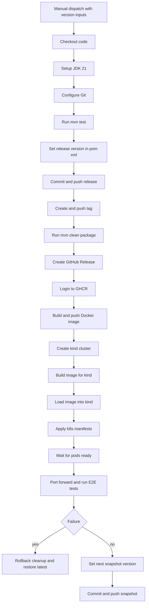

# Release Workflow (Maven Project)

```mermaid
flowchart TD
  A[Manual dispatch with version inputs] --> B[Checkout code]
  B --> C[Setup JDK 21]
  C --> D[Configure Git]
  D --> E[Run mvn test]
  E --> F[Set release version in pom xml]
  F --> G[Commit and push release]
  G --> H[Create and push tag]
  H --> I[Run mvn clean package]
  I --> J[Create GitHub Release]
  J --> K[Login to GHCR]
  K --> L[Build and push Docker image]
  L --> M[Create kind cluster]
  M --> N[Build image for kind]
  N --> O[Load image into kind]
  O --> P[Apply k8s manifests]
  P --> Q[Wait for pods ready]
  Q --> R[Port forward and run E2E tests]
  R --> S{Failure}
  S -- yes --> T[Rollback cleanup and restore latest]
  S -- no --> U[Set next snapshot version]
  U --> V[Commit and push snapshot]
```
